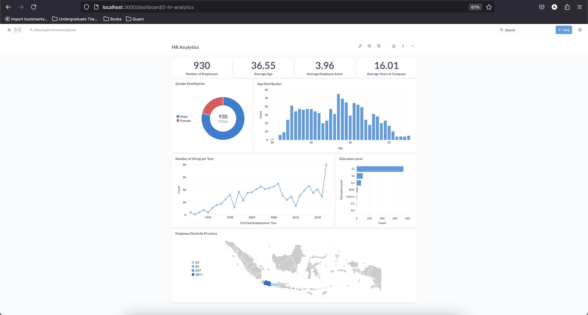

# Data Processing Optimization Benchmark
This directory performs an ETL (Extract, Transform, Load) process on employee data from a excel file. The pipeline consist of cleans, transforms, and loads the data into a target database for reporting. Here is the diagram of the pipeline:


# Tech Stack
1. Python: Run the ETL script.

2. Docker: Containerizes Metabase and PostgreSQL.

3. PostgreSQL: Use for data warehouse

4. Metabase: Dashboard for reporting

# Project Structure
```bash
Point 2/
├── .gitignore              # List of ignored files in git repo
├── column_description.txt  # Short description for each columns
├── dashboard.png           # Example of the final dashboard
├── dataset.xlsx            # Dataset source
├── docker-compose.yaml     # Docker compose that running required services
├── etl.py                  # Main script to run ETL process
├── README.md               # Documentation
├── requirements.txt        # Library required to run the project
├── utils.py                # Helper function
```

# How to Run
1. Install dependencies
    ```bash
    pip install -r requirements.txt
    ```

2. Run docker container
    ```bash
    docker compose up -d
    ```

3. Run the `etl.py` script
    ```bash
    python etl.py --excel_path dataset.xlsx
    ```
    
    Example output
    ```
    [INFO] Starting ETL process...
    [INFO] Extracting data from 'dataset.xlsx'...
    [INFO] Transforming data...
    [INFO] Loading data into database...
    [INFO] ETL process completed successfully.
    ```
4. Navigate to `localhost:3000` to open the Metabase dashboard. Create a new dashboard using the loaded data warehouse. Below is an example of a completed dashboard.


# Disclaimer
I'm using the ARM version image of Metabase to run on my machine with ARM architecture. If you're using an AMD-based machine, you'll need to change the image in `docker-compose.yaml`.